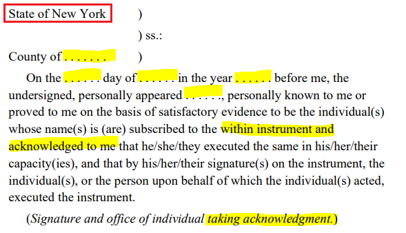
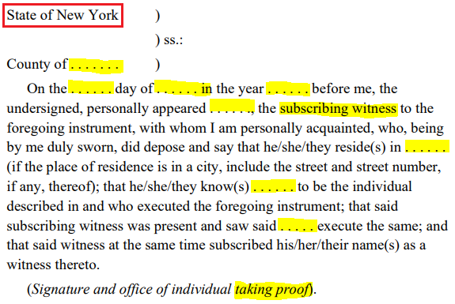
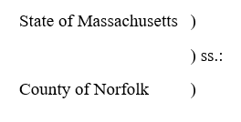
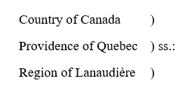
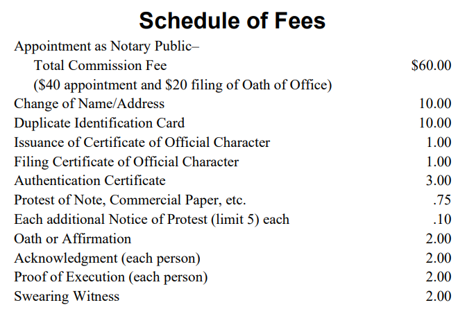

# **Notary Public License Law (January 2023) - Notes**

## **Contents**
- [**Resources**](#resources)
- [**Intro**](#intro)
- [**Professional Conduct**](#professional-conduct)
- [**APPOINTMENT AND QUALIFICATIONS EXECUTIVE LAW**](#appointment-and-qualifications-executive-law)
    - [§130. Appointment of notaries public.](#130-appointment-of-notaries-public)
    - [§131. Procedure of appointment; fees and commissions.](#131-procedure-of-appointment-fees-and-commissions)
    - [§132. Certificates of official character of notaries public.](#132-certificates-of-official-character-of-notaries-public)
    - [§133. Certification of notarial signatures.](#133-certification-of-notarial-signatures)
    - [§140. Executive Law.](#140-executive-law)
    - [§3-200 and 3-400. Election Law.](#3-200-and-3-400-election-law)
    - [§3. Public Officer Law.](#3-public-officer-law)
    - [§534. County Law.](#534-county-law)
- [**Miscellaneous**](#miscellaneous)
    - [Member of legislature.](#member-of-legislature)
    - [Sheriffs.](#sheriffs)
    - [Notary public—disqualifications.](#notary-publicdisqualifications)
- [**Powers and Duties**](#powers-and-duties)
    - [§134. Signature and seal of county clerk.](#134-signature-and-seal-of-county-clerk)
    - [§135. Powers and duties; in general; of notaries public who are attorneys at law.](#135-powers-and-duties-in-general-of-notaries-public-who-are-attorneys-at-law)
    - [§135-a. Notary Public or commissioner of deeds; acting without appointment; fraud in office.](#135-a-notary-public-or-commissioner-of-deeds-acting-without-appointment-fraud-in-office)
    - [§135-b. Advertising by notaries public.](#135-b-advertising-by-notaries-public)
    - [§136. Notarial fees.](#136-notarial-fees)
    - [§137. Statement as to authority of notaries public.](#137-statement-as-to-authority-of-notaries-public)
    - [§138. Powers of notaries public or other officers who are stockholders, directors, officers or employees of a corporation.](#138-powers-of-notaries-public-or-other-officers-who-are-stockholders-directors-officers-or-employees-of-a-corporation)
    - [§142-a. Validity of acts of notaries public and commissioners of deeds notwithstanding certain defects.](#142-a-validity-of-acts-of-notaries-public-and-commissioners-of-deeds-notwithstanding-certain-defects)
- [**Real Property Law**](#real-property-law)
    - [§290. Definitions; effect of article.](#290-definitions-effect-of-article)
    - [§298. Acknowledgments and proofs within the state.](#298-acknowledgments-and-proofs-within-the-state)
    - [§302. Acknowledgments and proofs by married women.](#302-acknowledgments-and-proofs-by-married-women)
    - [§303. Requisites of acknowledgments.](#303-requisites-of-acknowledgments)
    - [§304. Proof by subscribing witness.](#304-proof-by-subscribing-witness)
    - [§306. Certificate of acknowledgment or proof.](#306-certificate-of-acknowledgment-or-proof)
    - [§309-a. Uniform forms of certificates of acknowledgment or proof within this state.](#309-a-uniform-forms-of-certificates-of-acknowledgment-or-proof-within-this-state)
    - [§309-b. Uniform forms of certificates of acknowledgment or proof without this state.](#309-b-uniform-forms-of-certificates-of-acknowledgment-or-proof-without-this-state)
    - [§330. Officers guilty of malfeasance liable for damages.](#330-officers-guilty-of-malfeasance-liable-for-damages)
    - [§333. When conveyances of real property not to be recorded.](#333-when-conveyances-of-real-property-not-to-be-recorded)
    - [Special Note.](#special-note)
    - [§335. Banking Law.](#335-banking-law)
    - [Rule 3113. Civil Practice Law and Rules.](#rule-3113-civil-practice-law-and-rules)
    - [§11. Domestic Relations Law.](#11-domestic-relations-law)
    - [§10. Public Officers Law.](#10-public-officers-law)
- [**Restrictions and Violations**](#restrictions-and-violations)
    - [§484. None but attorneys to practice in the state.](#484-none-but-attorneys-to-practice-in-the-state)
    - [§485. Violation of certain preceding sections a misdemeanor.](#485-violation-of-certain-preceding-sections-a-misdemeanor)
    - [§750. Power of courts to punish for criminal contempts.](#750-power-of-courts-to-punish-for-criminal-contempts)
    - [Illegal practice of law by notary public.](#illegal-practice-of-law-by-notary-public)
    - [Wills.](#wills)
    - [§15 Public Officers Law.](#15-public-officers-law)
    - [§67. Fees of public officers.](#67-fees-of-public-officers)
    - [§69. Fee for administering certain official oaths prohibited.](#69-fee-for-administering-certain-official-oaths-prohibited)
    - [Misconduct by a notary and removal from office.](#misconduct-by-a-notary-and-removal-from-office)
    - [§70.00 Sentence of imprisonment for felony.](#7000-sentence-of-imprisonment-for-felony)
    - [§70.15 Sentences of imprisonment for misdemeanors and violation.](#7015-sentences-of-imprisonment-for-misdemeanors-and-violation)
    - [§170.10 Forgery in the second degree.](#17010-forgery-in-the-second-degree)
    - [§175.40 Issuing a false certificate.](#17540-issuing-a-false-certificate)
    - [§195.00 Official misconduct.](#19500-official-misconduct)
    - [Notary must officiate on request.](#notary-must-officiate-on-request)
    - [Perjury.](#perjury)
- [**TITLE 19 NYCRR CHAPTER V, SUBCHAPTER L | PART 182 NOTARIES PUBLIC**](#title-19-nycrr-chapter-v-subchapter-l--part-182-notaries-public)
    - [§182.1 Advertising](#1821-advertising)
- [**Definitions and General Terms**](#definitions-and-general-terms)
    - [Acknowledgment](#acknowledgment)
    - [Administrator](#administrator)
    - [Affiant](#affiant)
    - [Affidavit](#affidavit)
    - [Affirmation](#affirmation)
    - [Apostille](#apostille)
    - [Attest](#attest)
    - [Attestation Clause](#attestation-clause)
    - [Authentication](#authentication)
    - [Bill of Sale](#bill-of-sale)
    - [Certified Copy](#certified-copy)
    - [Chattel](#chattel)
    - [Chattel Paper](#chattel-paper)
    - [Codicil](#codicil)
    - [Consideration](#consideration)
    - [Contempt of Court](#contempt-of-court)
    - [Contract](#contract)
    - [Conveyance (Deed)](#conveyance-deed)
    - [County Clerk’s Certificate](#county-clerks-certificate)
    - [Deponent](#deponent)
    - [Deposition](#deposition)
    - [Duress](#duress)
    - [Escrow](#escrow)
    - [Executor](#executor)
    - [Ex Parte (From One Side Only)](#ex-parte-from-one-side-only)
    - [Felony](#felony)
    - [Guardian](#guardian)
    - [Judgment](#judgment)
    - [Jurat](#jurat)
    - [Laches](#laches)
    - [Lease](#lease)
    - [Lien](#lien)
    - [Litigation](#litigation)
    - [Misdemeanor](#misdemeanor)
    - [Mortgage On Real Property](#mortgage-on-real-property)
    - [Notary Public](#notary-public)
    - [Oath](#oath)
    - [Plaintiff](#plaintiff)
    - [Power of Attorney](#power-of-attorney)
    - [Proof](#proof)
    - [Protest](#protest)
    - [Seal](#seal)
    - [Signature of Notary Public](#signature-of-notary-public)
    - [Statute](#statute)
    - [Statute of Frauds](#statute-of-frauds)
    - [Statute of Limitations](#statute-of-limitations)
    - [Subordination Clause](#subordination-clause)
    - [Sunday](#sunday)
    - [Swear](#swear)
    - [Taking an Acknowledgment](#taking-an-acknowledgment)
    - [Venue](#venue)
    - [Will](#will)
- [Fees](#fees)

## **Resources**

**Hold `CTRL` then `Left Click` the links to open in a New Tab, or hover over the link and push down the `Scroll Wheel`.**

- [NY Notary Public Official Website](https://dos.ny.gov/notary-public)
- Notary Law
    - [NY Notary Law - 2023 (PDF)](https://dos.ny.gov/system/files/documents/2023/01/notary-public-license-law_01.2023.pdf)
    - [NY Notary Law - Unofficial 2022 Revised (PDF)](https://www.nationalnotary.org/file%20library/nna/reference-library/state-law-summaries/new_york.pdf)
    - [National Notary (Notary Law Database & Updates)](https://www.nationalnotary.org/knowledge-center/news/law-updates)
    - Article 6 - DEPARTMENT OF STATE LAW 
        - [[Link 1](https://www.nysenate.gov/legislation/laws/EXC/A6) | [Link 2](https://casetext.com/statute/consolidated-laws-of-new-york/chapter-executive/article-6-department-of-state)]
- Flash Cards
    - [[Link 1](https://quizlet.com/56144981/new-york-state-notary-public-license-exam-flash-cards/) | [Link 2](https://quizlet.com/593263503/new-york-notary-exam-practice-test-flash-cards/)]
- Practice Exams 
    - [[Exam 1](https://www.howtobecomeanotaryinny.com/sample-ny-notary-practice-exam.html) | [Exam 2](https://quizlet.com/592341178/new-york-notary-practice-test-1-flash-cards/) | [Exam 3](https://quizlet.com/592374572/new-york-notary-practice-test-2-flash-cards/) | [Exam 4](https://quizlet.com/592617412/new-york-state-notary-practice-test-3-flash-cards/) | [Exam 5](https://quizlet.com/592645638/new-york-notary-practice-test-4-flash-cards/) | [Exam 6](https://quizlet.com/592659228/new-york-notary-practice-test-5-flash-cards/) | [Exam 7](https://quizlet.com/592678029/new-york-notary-practice-test-6-flash-cards/) | [Exam 8](https://quizlet.com/593263503/new-york-notary-exam-practice-test-flash-cards/) | [Exam 9](https://quizlet.com/131355548/notary-practice-test-1-flash-cards/) | [Exam 10](https://quizlet.com/131380862/notary-practice-test-2-flash-cards/) | [Exam 11](https://quizlet.com/132497728/notary-practice-test-3-flash-cards/)]
- Definitions
	- [Legal Dictionary](https://www.law.cornell.edu/wex/all)
- Forms
    - Acknowledgements
        - [New York notary acknowledgement forms](https://notaryacknowledgement.com/ny/)
        - [All Purpose Acknowledgement (PDF)](https://www.dutchessny.gov/All-Purpose-Acknowledgement.pdf)
        - [Acknowledgement (PDF)](https://www.dec.ny.gov/docs/lands_forests_pdf/acknowledgment13.pdf)
    - Jurat
        - [Jurat Sample (JPG)](https://www.nationalnotary.org/image%20library/nna/bulletin/bulletin-jurat-large.jpg)
- Stamp Purchase
    - [Round Stamp](https://www.allstatenotarysupplies.com/ny-notary-round-exp-stamp)
    - [Round Stamp (Pink)](https://www.allstatenotarysupplies.com/new-york-notary-pink-with-county-and-expiration-round-stamp)
    - [Rectangle](https://www.allstatenotarysupplies.com/ny-notary-rectangle)
    - [Rectangle (Pink)](https://www.allstatenotarysupplies.com/new-york-notary-pink-stamp-rectangle)

<a href="#Contents">[Back to Top]</a>

## **Intro**

**Notary Application**
- Must pass the New York State notary public examination
- Must submit application to the **Division of Licensing Services**,:
    - An oath of office, which must be sworn and notarized
    - $60 fee
    - Exam 'pass' slip
- After **approving** an application, ***Secretary of State forwards*** to the appropriate county clerk,:
    - The commission
    - The original oath of office
    - The signature of the notary public

**Notary Public**
- Commissioned by the **Secretary of State**.
- Notary commission (term) is **4 years**
- Notaries are commissioned in their **counties of residence**.
- County clerk maintains a record of the commission and signature.
- The public can access this record and verify the “official” signature at the county clerk’s office.
- County clerks will authenticate signature of the notary and attest to the notary’s authority to sign.
- Notaries may elect to file a certificate of official character with other New York State county clerks.

**Attorneys**
- **Court clerks** and practicing **NYS Attorneys** may be appointed a notary public **without examination**.
- **Attorneys and Nonresidents** residing out of state, but maintain an office in state are deemed residents of the county of their office location.
    - Oath of office and signature of the notary must be filed.

<a href="#Contents">[Back to Top]</a>

## **Professional Conduct**

- Taking acknowledgements or affidavits without the personal appearance of the individual making them is illegal.
    - **As of 2/25/22, NY state now legally allows an individual to appear for the signing remotely/virtually over video conferencing applications**
- Simplest form of a lawfully administered oath:
    - `"Do you solemnly swear that the contents of this affidavit subscribed by you is correct and true?"`
- For persons who conscientiously decline taking an oath (*someone who will not, or cannot, swear a religious oath*).
    - `"Do you solemnly, sincerely and truly declare and affirm that the statements made by you are true and correct?"`

**A notary public**:
1. **May not give legal advise, unless you are a lawyer.**
    - May not draw up any legal documents or any papers that the courts deem legal documents or papers. [(List of Legal Documents)](https://legaltemplates.net/form/)
        - If so, you will be removed as a notary, fined, and possible imprisonment.
2. **May not ask for and get legal business.**
3. **May not divide or agree to divide their fee with a lawyer.**
4. **May not advertise in any paper or advertisement, any powers or rights they are not given as a notary.**
	- Also may not execute an acknowledgement of a will and cannot be deemed an attestation.

<a href="#Contents">[Back to Top]</a>

## **APPOINTMENT AND QUALIFICATIONS EXECUTIVE LAW**

### §130. Appointment of notaries public.

- The Secretary of state may appoint as many notaries they deem fit, under the jurisdiction in the state of NY.
- Notary term is 4 years.
- Notary must be resident of the state or have a place of business within NY.
    - If a notary moves out of state, but maintains a business or office in NY, they may keep their notary title.
    - If a notary moves out of state and ceases to have a business or office in NY, they **vacate** their notary title.
- Qualified notary must:
    - Be of good moral character
    - Have a common school education
    - Be familiar with their duties and responsibilities
- May reapply for notary 6 months before notary title expires.
    - If the notary is enlisted in the armed forces and misses the 6 month window because of military service, they may reapply within 1 year before expiration.
- The secretary of state may suspend or remove a notary.
    - SoS (Secretary of State) must provide a copy of the charges and notary must be heard before suspension or removal.
- No person shall be appointed notary if they are convicted of a crime.
    - Unless in in conformance with statutory requirements in [Article 23-A](https://www.nysenate.gov/legislation/laws/COR/A23-A)
- An attorney and councilor in the courts with an office of practice residing in NY state may be appointed notary and deemed resident of the county.

<a href="#Contents">[Back to Top]</a>

### §131. Procedure of appointment; fees and commissions.

1. Applicants shall submit their application and oath of office with their signature.
2. Applicants will be appointed notary public after proving competency and good moral character.
3. $60 application fee and application must be submitted.
4. Applicant will receive a notary public ID card.
5. The SoS will submit the commission and certified copy/original oath of office and official signature to the county clerk by the 10th of the following month
6. The county clerk will keep an index of commissions and official signatures.
7. For reappointment, submit the oath of office, signed by you and an authorized authority.
8. County clerk can issue a recommission after application for reappointment is received.
9. Fee of $60 to county clerk for reappointment.
10. $40 of the $60 from the application fee will be given to the SoS by the 10th day of the following month.
11. The SoS will make a record of commissions transferred from the county clerk.
12. $10 fee for change of name or address.
13. A duplicate ID may be issued if lost/destroyed/damaged; ID will have "Duplicate" stamped on it.

<a href="#Contents">[Back to Top]</a>

### §132. Certificates of official character of notaries public.

- The SoS or count clerk of the county may certify a CoOC (Certificate of Official Character) of a notary in any county in the state.
- SoS gets $1 for each CoOC issued by them.
- County clerk get $1 for each CoOC filed by them.

<a href="#Contents">[Back to Top]</a>

### §133. Certification of notarial signatures.

- $3 fee for the county clerk to confirm that any certificate of proof, acknowledgment, or oath signed by a notary is genuine.
- County clerk confirms the commission (the notary is an actual appointed notary) and the official signature of character (the notary's signature).
- After the signature of a notary is authenticated, a certificate of authentication is issued by the county clerk and the document signed by the notary can be read into evidence.

<a href="#Contents">[Back to Top]</a>

### §140. Executive Law.

- If a commissioner of deeds is **removed** from office, they cannot be reappointed as a commissioner of deeds or become a notary public.
- If removed from office, signing documents as a commissioner of deeds or notary public will result in a misdemeanor.

<a href="#Contents">[Back to Top]</a>

### §3-200 and 3-400. Election Law.

- A commissioner of elections or inspector of elections is eligible for the office of notary public.

<a href="#Contents">[Back to Top]</a>

### §3. Public Officer Law.

- You cannot become a notary public if you violated the [Selective Service Act of 1917](https://en.wikipedia.org/wiki/Selective_Service_Act_of_1917) or the [Selective Training and Service Act of 1940](https://en.wikipedia.org/wiki/Selective_Training_and_Service_Act_of_1940)

<a href="#Contents">[Back to Top]</a>

### §534. County Law.

- The county clerk designates a single member of their staff to notarize documents for the public, free of charge, during normal business hours.
- Any staff of the county clerk can be appointed as a notary public without examination or application fee.

<a href="#Contents">[Back to Top]</a>

## **Miscellaneous**

### Member of legislature.

- A member of legislature can be appointed notary public, but must vacate their seat as legislature.

<a href="#Contents">[Back to Top]</a>

### Sheriffs.

- Sheriffs cannot hold any other office.

<a href="#Contents">[Back to Top]</a>

### Notary public—disqualifications.

- A notary public is disqualified from signing a document if they have an expressed interest or benefit in the case.
    - *e.g. A notary who is a grantee or mortgagee in a conveyance or mortgage is disqualified to take the acknowledgment of the grantor or mortgagor.*

<a href="#Contents">[Back to Top]</a>

## **Powers and Duties**

### §134. Signature and seal of county clerk.

- The signature and seal of a county clerk can be a copy of the official signature, printed, stamped, photographed, or engraved onto a document.

<a href="#Contents">[Back to Top]</a>

### §135. Powers and duties; in general; of notaries public who are attorneys at law.

- Every notary is able to authorize and:
    - Administer oaths and affirmations
    - Take affidavits and depositions
    - Receive and certify:
        - Acknowledgements
        - Proof of deeds
        - Mortgages
        - Powers of attorney
    - Demand/protest acceptance/payment and non-acceptance/non-payment of:
        - Foreign & Inland bills of exchange (checks & currency)
        - Promissory notes and obligations
- **Attorneys** can administer to their clients: 
    - Oaths or Affirmations
    - Affidavits or Acknowledgements
- Notary Public is liable for any damages sustained by them.
- Notary **CANNOT** directly/indirectly demand/receive any amount above $.75 for their initial notarial seal and .10 for any additional notices with a limit of 5 on any bill or note.
- When requested, every notary must apply their seal free of charge.

***Useful links***
    
- [Bills of Exchange & Promissory Notes](https://www.investopedia.com/ask/answers/042415/what-difference-between-bill-exchange-and-promissory-note.asp#:~:text=Bills%20of%20exchange%20and%20promissory%20notes%20are%20written%20commitments%20between%20two%20parties%20that%20confirm%20a%20financial%20transaction%20has%20been%20agreed%20upon.%20Bills%20of%20exchange%20are%20more%20often%20used%20in%20international%20trade%2C%20whereas%20promissory%20notes%20are%20used%20most%20often%20in%20domestic%20trade.)
- Eligible Demands for Acceptance:
    - [Example of a Bill of Exchange](https://www.investopedia.com/terms/b/billofexchange.asp#toc-whats-the-difference-between-bill-of-exchange-and-promissory-note:~:text=Say%20Company%20ABC,ABC%2C%20the%20debtor.)
    - [Example of a Promissory Note](https://www.investopedia.com/terms/p/promissorynote.asp#:~:text=A%20promissory%20note%20is%20a%20written,anyone%20to%20act%20as%20a%20lender.)
- Eligible Protest:
    - [Protests](http://bdlaws.minlaw.gov.bd/act-46/act-chapter-print-142.html)
    - [Example Situation](https://www.investopedia.com/terms/n/notice-of-dishonor.asp#:~:text=For%20example%2C%20suppose,person%20X%E2%80%99s%20bank.)
    - [Protest steps](https://www.upcounsel.com/legal-def-protest#as-a-notarial-act:~:text=In%20making%20the,matter%20of%20form.)

<a href="#Contents">[Back to Top]</a>

### §135-a. Notary Public or commissioner of deeds; acting without appointment; fraud in office.

- Advertising or performing the duties of a notary public or commissioner of deeds, without being appointed, is considered fraud and will be guilty of a misdemeanor.

<a href="#Contents">[Back to Top]</a>

### §135-b. Advertising by notaries public.

1. This section (§135-b) does not apply to attorneys.
2. Notaries that advertise their services must include this in their advertisement:
    - `I am not an attorney licensed to practice law and may not give legal advice about immigration or any other legal matter or accept fees for legal advice.`
3. Cannot use terms in foreign languages to imply that you are an attorney.
4. "Advertisement" = Any material designed to promote or describe services of a notary including physical and online:
    - Business cards
    - Brochures
    - Notices
5. Violation of this section can result in:
    - Civil Penalty of $1000 (Recoverable by the Attorney General or SoS)
    - Suspension of notarial duties for 2nd offense
    - Removal of office (Notary title revoked) for 3rd offense, but:
        - **Notary must be served a copy of the charges against them and be given a chance to be heard.**
6. SoS may carry out these rules.

<a href="#Contents">[Back to Top]</a>

### §136. Notarial fees.

1. Administering and certifying an **oath or affirmation** = **$2**
2. Taking and certifying **acknowledgements, proof of execution, or swearing a witness** =  **$2**
    - **+$2** for each additional person

<a href="#Contents">[Back to Top]</a>

### §137. Statement as to authority of notaries public.

- A Notary's Statement of Authority must include:
    - Signature
    - Venue of the act
- Must also include (can be stamped):
    - **Name**
    - The words **`Notary Public State of New York`**
    - Name of the **county** you are qualified in
    - Notary **term expiration**
    - Notary **License Number**
    - (Optional) Other counties your signature is registered in
- Attorneys can replace `Notary Public` with `Attorney and Counselor at Law`.
- Mistakenly failing to provide the info above does not invalidate the Notary or the Statement of Authority.
- Willfully failing to comply with these rules may result in punishment.
- This statement can be received in all NY courts as **"Presumptive Evidence"**.
    - Can be contradicted by other evidence.

<a href="#Contents">[Back to Top]</a>

### §138. Powers of notaries public or other officers who are stockholders, directors, officers or employees of a corporation.

    - A notary public
    - Justice of the supreme court
    - Judge
    - Clerk
    - Deputy clerk
    - Special deputy clerk of a court
    - Official examiner of title
    - Mayor or recorder of a city
    - A justice of the peace
    - Surrogate
    - Special Surrogate
    - Special county judge
    - Commissioner of deeds
- Can all notarize for any party within a company, even if the notary is a:
    - Stakeholder
    - Director
    - Officer
    - Employee
- Cannot notarize if they directly/indirectly benefit financially.
- Does not affect any previous pending/ongoing legal proceedings.

<a href="#Contents">[Back to Top]</a>

### §142-a. Validity of acts of notaries public and commissioners of deeds notwithstanding certain defects.

1. Official signatures of a notary will not be deemed invalid/defective from the time of being appointed (becoming a notary or commissioner of deeds) and after.
2. Valid defects of a notary/commissioner of deeds include:
    - Not being a notary/commissioner of deeds.
    - Misspelling of their name in appointment.
    - Omission to take or file their official oath of office.
    - Expired term.
    - Vacating (leaving) office.
    - Acting or signing outside of their jurisdiction.
3. Nobody is entitled to assert the effect of a defective notary signature, after knowing of the valid defects.
    - Does not apply 6 months after the act of the signing.
4. After 6 months from the date of the act, The signature can be deemed defective.
5. Does not relieve notary from liability of damages or criminal charges.

<a href="#Contents">[Back to Top]</a>

## **Real Property Law**

### §290. Definitions; effect of article.

- [[Link]](https://www.investopedia.com/terms/c/conveyance.asp#:~:text=THOMAS%20J.%20CATALANO-,What%20Is%20a%20Conveyance%3F,transfer%2C%20as%20well%20as%20the%20obligations%20and%20responsibilities%20of%20both%20parties.,-KEY%20TAKEAWAYS) **"Conveyance"** is the act of transferring property (**typically real estate**) from one party to another.
- An **"Instrument of Conveyance"** is any legal document (**NOT INCLUDING A WILL**) used to allow the transfer of property. 
- Examples include:
    - Contract
    - Lease
    - Title
    - Mortgage
    - Deed
    - Lien

<a href="#Contents">[Back to Top]</a>

### §298. Acknowledgments and proofs within the state.

1. The acknowledgment or proof of a conveyance can be made at any place within the state, before any:
    - Justice of the supreme court
    - Official examiner of title
    - Official referee
    - Notary public
2. Also, before:
    - A judge or clerk of any court of record
    - A commissioner of deeds outside of the City of New York
    - The mayor or recorder of a city
    - Surrogate, special surrogate, or special county judge
    - The county clerk or other recording officer of a county
3. Also, before:
    - Justice of the peace
    - Town councilman
    - Village police justice
    - Judge of any court of inferior local jurisdiction

<a href="#Contents">[Back to Top]</a>

### §302. Acknowledgments and proofs by married women.

- Married woman can take acknowledgements or proof of a conveyance.

<a href="#Contents">[Back to Top]</a>

### §303. Requisites of acknowledgments.

- The person requesting the acknowledgement must provide valid proof of ID.

<a href="#Contents">[Back to Top]</a>

### §304. Proof by subscribing witness.

- "**Subscribing Witness**" of a proof must provide their address and valid proof of ID.
- Must sign off that they knew the person described in/who executed the document, and they saw such person execute such document.

<a href="#Contents">[Back to Top]</a>

### §306. Certificate of acknowledgment or proof.

- [[Link]](https://notarypublicunderwriters.com/national-notary-blog/250-national-notary-law/920-the-difference-between-an-acknowledgment-and-a-proof#:~:text=An%20acknowledgment%20is,terms%20laid%20out.) **"Acknowledgment"** Is a declaration made by a notary public that the document in question was voluntarily completed by the signer.
    - "**Taking an Acknowledgment**" involves an understanding of the document and a commitment to fulfill the contents/agreements of the document.
- [[Link]](https://notarypublicunderwriters.com/national-notary-blog/250-national-notary-law/920-the-difference-between-an-acknowledgment-and-a-proof#:~:text=The%20procedure%20for,the%20original%20signing.) A "**Proof**" is often just an affidavit in which a "**Subscribing Witness**" gives a sworn statement about the details of the original signing.
    - The procedure for "**Taking A Proof**" involves a subscribing witness.

<a href="#Contents">[Back to Top]</a>

### §309-a. Uniform forms of certificates of acknowledgment or proof within this state.

**
▼ Certificate of an Acknowledgement (In NY State) ▼
**

 

**
▼ Certificate of a Proof (In NY State) ▼
**

4. The term "Person" means:
    - Corporation
    - Joint stock company
    - Estate
    - General Partnership
    - Limited Liability Company (LLC)
    - Foreign LLC
    - Join Venture
    - Limited Partnership
    - Natural Person
    - [Attorney-In-Fact](https://www.investopedia.com/terms/a/attorneyinfact.asp#:~:text=JULIUS%20MANSA-,What%20Is%20an%20Attorney%2Din%2DFact%3F,The%20rules%20regulating%20power%20of%20attorney%20vary%20from%20state%20to%20state.,-1)
    - Real Estate Investment Trust
    - Business Trust
    - Custodian
    - Nominee
    - Any individual or entity

<a href="#Contents">[Back to Top]</a>

### §309-b. Uniform forms of certificates of acknowledgment or proof without this state.

    All writing for the acknowledgement and proof are the same, they just require different headings.

**
▼ Acknowledgement & Proof (Outside of NY State) ▼
**

**
▼ Acknowledgement & Proof (Outside of the US) ▼
**

- Required sections cannot be modified within the acknowledgement or proof.

- Only the heading can be changed.

<a href="#Contents">[Back to Top]</a>

### §330. Officers guilty of malfeasance liable for damages.

- Anyone authorized to take/certify acknowledgements & proofs, who are guilty of malfeasance or fraud, are liable in damages to the person effected.

<a href="#Contents">[Back to Top]</a>

### §333. When conveyances of real property not to be recorded.

- A Recording officer cannot record or accept for record any conveyance this not in english.
- If the conveyance is not in english, it must be translated by a certified translator.
- The translator must attach a copy of their certification of translation.

<a href="#Contents">[Back to Top]</a>

### Special Note.

- Limitations for notaries relating to Real Property law have been removed.
- Notaries can now administer oaths, take affidavits/acknowledgements/proofs of conveyance anywhere within the state of NY.
- As of September 23, 2012, Recording officers (County Clerks) are able to receive and record documents electronically. This includes:
    - Deeds
    - Mortgages
    - Notes
    - Other accompanying documents

<a href="#Contents">[Back to Top]</a>

### §335. Banking Law.

- If the fee for a safety deposit box isn't paid or the lease is terminated, **within 30 days notice, while a notary is present**, the bank (**Lessor**) can:
    - Open the box
    - Remove the contents
    - Take inventory of the contents
- The notary files a certificate with the bank that contains:
    - The date of the opening
    - The owner's (**Lessee**) name of the box
    - The list of contents
- Within **10 days** of the opening, a copy of the certificate must be mailed to the owner's previous address.

<a href="#Contents">[Back to Top]</a>

### Rule 3113. Civil Practice Law and Rules.

- This rule authorizes a [deposition](https://www.law.cornell.edu/wex/deposition#:~:text=A%20deposition%C2%A0is%20a%20witness%27s%20sworn%20out%2Dof%2Dcourt%20testimony.%20It%20is%20used%20to%20gather%20information%20as%20part%20of%20the%C2%A0discovery%C2%A0process%20and%2C%20in%20limited%20circumstances%2C%20may%20be%20used%20at%20trial.%20The%20witness%20being%20deposed%20is%20called%20the%20%22deponent.%22) to be taken before a notary public in a civil proceeding

<a href="#Contents">[Back to Top]</a>

### §11. Domestic Relations Law.

- Notaries cannot solemnize marriages or take the acknowledgment of parties and witnesses to a written contract of marriage.

<a href="#Contents">[Back to Top]</a>

### §10. Public Officers Law.

- Official oaths, permits the oath of a public officer to be administered by a notary public.

<a href="#Contents">[Back to Top]</a>

## **Restrictions and Violations**

### §484. None but attorneys to practice in the state.

- No attorney can ask anyone other than another practicing NY State attorney to substitute for them or receive compensation for preparing:
    - Deeds
    - Mortgages
    - Assignments
    - Discharges
    - Leases
    - Anything affecting real estate, wills, or [codicil](https://www.google.com/search?q=Codicil&sourceid=chrome&ie=UTF-8#:~:text=an%20addition%20or%20supplement%20that%20explains%2C%20modifies%2C%20or%20revokes%20a%20will%20or%20part%20of%20one.)
1. Officers of societies for the prevention of cruelty to children and animals, must be represented by an attorney to execute [special powers](https://codes.findlaw.com/ny/notforprofit-corporation-law/npc-sect-1403.html#:~:text=(b)%E2%80%82Special%20powers,any%20proceeding%20therein.).
2. **Law students can practice law if they**:
    - Completed 2 Semesters of law school
    - [Have taken the bar exam (pass or fail)](https://www.nybarexam.org/eligible/eligibility.htm#:~:text=New%20York%20is%20one%20of%20only%20a%20few%20jurisdictions%20that%20permits%20an%20applicant%20to%20qualify%20to%20take%20the%20bar%20examination%20on%20the%20basis%20of%20some%20law%20school%20study%20combined%20with%20law%20office%20study%20or%20clerkship.)
    - Are acting under the supervision of a legal aid organization [approved by the appellate division of the supreme court](https://www.nycourts.gov/courts/ad2/aboutthecourt.shtml#:~:text=The%20Appellate%20Division%20is,the%20State%27s%20highest%20court.).
3. **Law school graduates can practice law if they**:
    - Have taken the bar exam and **passed**
    - If they **failed** the bar exam, are acting under the supervision of a legal aid organization approved by the appellate division of the supreme court.

<a href="#Contents">[Back to Top]</a>

### §485. Violation of certain preceding sections a misdemeanor.

  <u>**In summary: Don't practice law, give legal advice, or advertise as a lawyer if you are not a lawyer.**</u>

- Any person violating the provisions of these sections shall be guilty of a misdemeanor.
    - [§478](https://www.nysenate.gov/legislation/laws/JUD/478#:~:text=SECTION%20478,admitted%20and%20registered) - *Practicing or appearing as attorney-at-law without being admitted and registered.*
    - [§479](https://www.nysenate.gov/legislation/laws/JUD/479#:~:text=SECTION%20479,of%20an%20attorney) - *Soliciting business on behalf of an attorney.*
    - [§480](https://www.nysenate.gov/legislation/laws/JUD/480#:~:text=SECTION%20480,release%20or%20statement) - *Entering hospital to negotiate settlement or obtain release or statement.*
    - [§481](https://www.nysenate.gov/legislation/laws/JUD/481#:~:text=Aiding%2C%20assisting%20or%20abetting%20the%20solicitation%20of%20persons%20or%20the%20procurement%20of%20a%20retainer%20for%20or%20on%20behalf%20of%20an%20attorney) - *Aiding, assisting or abetting the solicitation of persons or the procurement of a retainer for or on behalf of an attorney.*
    - [§482](https://www.nysenate.gov/legislation/laws/JUD/482#:~:text=%C2%A7%20482.%20Employment%20by%20attorney%20of%20person%20to%20aid%2C%20assist%20or%20abet%20in%20the%0Asolicitation%20of%20business%20or%20the%20procurement%20through%20solicitation%20of%20a%0Aretainer%20to%20perform%20legal%20services.) - *Employment by attorney of person to aid, assist or abet in the solicitation of business or the procurement through solicitation of a retainer to perform legal services.*
    - [§483](https://www.nysenate.gov/legislation/laws/JUD/483#:~:text=SECTION%20483,attorney%20at%20law) - *Signs advertising services as attorney at law.*
    - [§484](https://www.nysenate.gov/legislation/laws/JUD/484#:~:text=SECTION%20484,in%20the%20state) - *None but attorneys to practice in the state.*

<a href="#Contents">[Back to Top]</a>

### §750. Power of courts to punish for criminal contempts.

- The supreme court has the ability to punish anyone unlawfully practicing as a lawyer.

<a href="#Contents">[Back to Top]</a>

### Illegal practice of law by notary public.

- Practicing law, giving legal advice, and drafting legal documents, including wills, are all considered law practice. 
- It's all illegal if you are not a lawyer. Don't do it. 

<a href="#Contents">[Back to Top]</a>

### Wills.

- The execution of a will without a lawyer present will potentially render the will worthless.
- A lawyer must be present when creating and executing a will.

<a href="#Contents">[Back to Top]</a>

### §15 Public Officers Law.

- A notary public is a public officer.
- Notary must not act before taking and filing oath of office.
- Doing so is a misdemeanor.

<a href="#Contents">[Back to Top]</a>

### §67. Fees of public officers.

1. Must perform your duty without compensation unless a fee is specified by law.
2. If a fee is specified by law, you cannot receive more than what is specified.
3. Cannot demand fees if services were not performed. 
    - Can ask for fees in advance, before performing the service.
4. Subject to criminal prosecution, civil suit and possible removal if you violate this section.

<a href="#Contents">[Back to Top]</a>

### §69. Fee for administering certain official oaths prohibited.

- A notary is **not entitled to a fee** for **administering the oath of office** to:
    - A member of the legislature
    - Any military officer
    - An inspector of election
    - Clerk of the poll
    - Public employees
    - Other public officers

<a href="#Contents">[Back to Top]</a>

### Misconduct by a notary and removal from office.

- Misconduct by a notary will result in removal from office if they:
    - Perform any fraud or deceit (Misdemeanor)
    - Lied in their notary application
    - Taking the oath of an *affiant (a person who swears to an affidavit)* to a knowingly false statement.

<a href="#Contents">[Back to Top]</a>

### §70.00 Sentence of imprisonment for felony.

- Jail Sentencing
    - [Indeterminate sentence](https://www.law.cornell.edu/wex/indeterminate_sentence#:~:text=which%20means%20the%20convicted%20person%27s%20release%20date%20is%20left%20open.)
        - 3 Years (Max)
    - **Class E Felony**
        - **4 Years (Max)**
    - **Class D Felony**
        - **7 Years (Max)**

<a href="#Contents">[Back to Top]</a>

### §70.15 Sentences of imprisonment for misdemeanors and violation.

- **[Class A Misdemeanor](https://omh.ny.gov/omhweb/forensic/manual/html/chapter1.htm#:~:text=Upon%20conviction%20of%20a%20Class%20%E2%80%9CA%E2%80%9D%20misdemeanor%2C%20a%20court%20may%20sentence%20an%20individual%20to%20a%20maximum%20of%20one%20year%20in%20jail%20or%20three%20years%20probation.%20In%20addition%2C%20a%20fine%20of%20up%20to%20%241%2C000%20or%20twice%20the%20amount%20of%20the%20individual%E2%80%99s%20gain%20from%20the%20crime%20may%20be%20imposed.)**
    - **1 Year (Max)** or 3 Years probation
    - Fine of $1,000 or twice the amount of the individual’s gain from the crime.

<a href="#Contents">[Back to Top]</a>

### §170.10 Forgery in the second degree.

- Forgery in the second degree is a **Class D Felony**.
- Falsely makes, completes or alters a written document to defraud, deceive or injure another.

<a href="#Contents">[Back to Top]</a>

### §175.40 Issuing a false certificate.

- Issuing a false certificate is a **Class E Felony**.
- Issuing a false certificate with intent to defraud, deceive or injure another person, knowing that it contains a false statement or false information.

<a href="#Contents">[Back to Top]</a>

### §195.00 Official misconduct.

- Official misconduct is a **Class A Misdemeanor**.
- Misconduct:
    - Performing unauthorized acts.
    - Not performing the duties of a notary when requested.

<a href="#Contents">[Back to Top]</a>

### Notary must officiate on request.

- Refusing to take an oath or affidavit is considered official misconduct and is a **Class A Misdemeanor**.

<a href="#Contents">[Back to Top]</a>

### Perjury.

- Making a statement or giving testimony as fact and knowing it's actually false.

<a href="#Contents">[Back to Top]</a>

## **TITLE 19 NYCRR CHAPTER V, SUBCHAPTER L | PART 182 NOTARIES PUBLIC**

### §182.1 Advertising

- A notary cannot advertise as a lawyer using any foreign languages.
- A notary that advertises their services, in any language, must include this in their advertisement (translated if necessary):
    - `I am not an attorney licensed to practice law and may not give legal advice about immigration or any other legal matter or accept fees for legal advice.`

<a href="#Contents">[Back to Top]</a>

## **Definitions and General Terms**

### Acknowledgment

- In the case of an acknowledgment, the notary public certifies as to the identity and execution of a document.
- An acknowledgment must not be taken unless he knows or has satisfactory evidence, that the person making it is the person described in and who executed such instrument.
- `on a specified date “before me came ...................., to me  known to be the individual described in and who executed the foregoing instrument and acknowledged that he executed the same.”`
- The **person who executed the instrument does not need to sign** his name in the presence of the notary.
- Taking acknowledgments over the telephone is illegal and a notary public is **guilty of a misdemeanor** in so acting.
    - Must Appear personally before the notary.

<a href="#Contents">[Back to Top]</a>

### Administrator

- A person appointed by the court to manage the estate of a deceased person who left no will.

### Affiant

- The person who makes and subscribes his signature to an affidavit.

<a href="#Contents">[Back to Top]</a>

### Affidavit

- A written statement confirmed by oath or affirmation, for use as evidence in court.
- **The venue**, or county where the affidavit was sworn should be stated.
- The wilful making of a false affidavit is perjury.
- The affidavit involves the administration of an oath to the affiant.
- **An affidavit is an ex parte statement.**

### Affirmation

- [A spoken pledge made on the signer’s personal honor with no reference to a higher power.](https://www.nationalnotary.org/notary-bulletin/blog/2015/05/your-guide-notary-oaths-affirmations#:~:text=a%20spoken%20pledge%20made%20on%20the%20signer%E2%80%99s%20personal%20honor%20with%20no%20reference%20to%20a%20higher%20power.)
- Equivalent to an oath and is just as binding.
- `“Do you solemnly, sincerely, and truly, declare and affirm that the statements made by you are true and correct.”`

<a href="#Contents">[Back to Top]</a>

### Apostille

- [Department of State authentication attached to a notarized and county-certified document for possible international use.](https://travel.state.gov/content/travel/en/records-and-authentications/authenticate-your-document/apostille-requirements.html#:~:text=Apostilles%20authenticate%20the%20seals%20and%20signatures%20of%20officials%20on%20public%20documents%20such%20as%20birth%20certificates%2C%20court%20orders%2C%20or%20any%20other%20document%20issued%20by%20a%20federal%20agency%20or%20certified%20by%20an%20American%20or%20foreign%20consul.)

### Attest

- To witness the execution of a written document.

<a href="#Contents">[Back to Top]</a>

### Attestation Clause

- A clause at the end of a will.
- The witnesses certify that the will has been executed.

### Authentication

- The county clerks certificate that authenticates a notary's authority.

<a href="#Contents">[Back to Top]</a>

### Bill of Sale

- The document passing the title of property from one person to another.

### Certified Copy

- A copy of a public record signed and certified as a true copy by the public official having custody of the original.
- **A notary public has no authority to issue certified copies.**
- **Notaries must not certify to the authenticity of legal documents.**

<a href="#Contents">[Back to Top]</a>

### Chattel

- Personal property, such as household goods or fixtures.

### Chattel Paper

- [A document used in secured transactions to sell property on credit while retaining some interest in the property.](https://www.law.cornell.edu/wex/chattel_paper#:~:text=a%20document%20used%20in%20secured%20transactions%20to%20sell%20property%20on%20credit%20while%20retaining%20some%20interest%20in%20the%20property.)

<a href="#Contents">[Back to Top]</a>

### Codicil

- An instrument made subsequent to a will and modifying it in some respects.

### Consideration

- Anything of value given to influence someone into entering into a contract.
- Money, Personal Services, love and affection, etc.

<a href="#Contents">[Back to Top]</a>

### Contempt of Court

- Behavior disrespectful of the authority of a court which disrupts the execution of court orders.

### Contract

- A written or spoken agreement between competent parties to do or not to do certain things intended to be enforceable by law.

<a href="#Contents">[Back to Top]</a>

### Conveyance (Deed)

- Every instrument, in writing, except a will, by which any estate or interest in real property is created, transferred, assigned or surrendered.

### County Clerk’s Certificate

- Authenticates a notary's authority.

<a href="#Contents">[Back to Top]</a>

### Deponent

- The witness who makes an oath to a written statement.
- **Used interchangeably with “Affiant.”**

### Deposition

- [A witness's sworn out-of-court testimony.](https://www.law.cornell.edu/wex/deposition#:~:text=A%20deposition%C2%A0is%20a%20witness%27s%20sworn%20out%2Dof%2Dcourt%20testimony.%20It%20is%20used%20to%20gather%20information%20as%20part%20of%20the%C2%A0discovery%C2%A0process%20and%2C%20in%20limited%20circumstances%2C%20may%20be%20used%20at%20trial.%20The%20witness%20being%20deposed%20is%20called%20the%20%22deponent.%22)
- May be used at trial.
- The witness being deposed is called the "deponent."

<a href="#Contents">[Back to Top]</a>

### Duress

- Forcing someone to do something against their will.

### Escrow

- The placing of an instrument in the hands of a escrow agent as a depository.
- On the happening of a designated event, the escrow agent delivers the instrument to a third person.
- This agreement, once established, should be unalterable.

<a href="#Contents">[Back to Top]</a>

### Executor

- A person or institution appointed by a testator to carry out the terms of their will.

### Ex Parte (From One Side Only)

- A hearing or examination in the presence of, or on papers filed by, one party and in the absence of the other.

<a href="#Contents">[Back to Top]</a>

### Felony

- A crime punishable by death or imprisonment in a state prison.

### Guardian

- A person in charge of a minor’s **person or property.**

<a href="#Contents">[Back to Top]</a>

### Judgment

- Decree of a court **declaring that one individual is indebted to another** and fixing the amount of such **indebtedness**.

### Jurat

- [A jurat is a certificate attached to an affidavit or deposition to signify that the affidavit or deposition was properly made before a duly authorized officer.](https://www.law.cornell.edu/wex/jurat#:~:text=A%20jurat%20is%20a%20certificate%20attached%20to%20an%20affidavit%20or%20deposition%20to%20signify%20that%20the%20affidavit%20or%20deposition%20was%20properly%20made%20before%20a%20duly%20authorized%20officer.)
- `“Sworn to before me this ........ day of ........, 20 ......”`

<a href="#Contents">[Back to Top]</a>

### Laches

- The **delay or negligence** in asserting one’s legal rights.

### Lease

- A contract between two parties where one party allows the other to use their property for a period of time in exchange for money.
- Usually paid monthly.

<a href="#Contents">[Back to Top]</a>

### Lien

- [A lien is a claim or legal right against assets that are usually used as collateral to satisfy a debt.](https://www.investopedia.com/terms/l/lien.asp#:~:text=A%20lien%20is%20a%20claim%20or%20legal%20right%20against%20assets%20that%20are%20typically%20used%20as%20collateral%20to%20satisfy%20a%20debt.)
- A creditor or a legal judgment could establish a lien.

### Litigation

- The act of carrying on a lawsuit.

<a href="#Contents">[Back to Top]</a>

### Misdemeanor

- [A misdemeanor is typically a crime punishable by less than 1 year in jail.](https://www.law.cornell.edu/wex/misdemeanor#:~:text=Misdemeanor-,Misdemeanor,for%20less%20than%20a%20year%20are%20commonly%20issued%20punishments%20for%20misdemeanors.,-More%20grievous%20crimes)
- Community service, probation, fines, and imprisonment for less than 1 year are commonly issued punishments for misdemeanors.
- **Any crime other than a felony.**

### Mortgage On Real Property

- [Involves the transfer of an interest in land as security for a loan or other obligation.](https://www.law.cornell.edu/wex/mortgage#:~:text=A%20mortgage%20involves%20the%20transfer%20of%20an%20interest%20in%20land%20as%20security%20for%20a%20loan%20or%20other%20obligation.%20It%20is%20the%20most%20common%20method%20of%20financing%20real%20estate%20transactions.%20The%20mortgagor%20is%20the%20party%20transferring%20the%20interest%20in%20land.)
- Most common method of financing real estate transactions.
- Usually in the form of a bond.

<a href="#Contents">[Back to Top]</a>

### Notary Public

- A person authorized by state law to perform various tasks that require an objective third party.
- Administers oaths and affirmations, certifies documents, and vouches for the authenticity of signatures.

### Oath

- A public pledge that a person will perform some action or duty, generally with the promise of doing so truthfully.
- **The person taking the oath must personally appear before the notary**
- **An oath cannot be administered over the telephone.**

<a href="#Contents">[Back to Top]</a>

### Plaintiff

- A person who starts a suit or brings an action against another.

### Power of Attorney

- A written statement by an individual giving another person the power to act for him.

<a href="#Contents">[Back to Top]</a>

### Proof

- A document signed by a witness, stating they knew the person described in and who executed the instrument.
- Proves they saw the person execute the instrument.

### Protest

- A formal statement written and signed by a notary public describing that a form of payment (bill of exchange or promissory note) was denied or refused to be accepted.

<a href="#Contents">[Back to Top]</a>

### Seal

- The laws of the State of New York do not require the use of seals by notaries public.
- If a seal is used, it should sufficiently identify the notary public, his authority and jurisdiction.
- Only inscription required is the name of the notary and the words `“Notary Public for the State of New York.”`

### Signature of Notary Public

- **A notary public must sign the name under which they were appointed and no other.**
- Notary must print in black ink:
    - Their signature
    - Venue
    - Their name
    - `"Notary Public State of New York"`
    - Name of the county they qualify in
    - Date of notary term expiration
- **When a notary marries during the term of office, they must continue to use the name they were commissioned under.**
- May place their married name in (parentheses) next to their signature and seal.
- May renew their notary term under their new married name.
- must perform all notarial functions under the name selected.
- May be appointed and may officiate as a notary public under the name by which he is known in religious circles.

<a href="#Contents">[Back to Top]</a>

### Statute

- A law established by an act of the Legislature.

### Statute of Frauds

- A law that requires written contracts for certain agreements to be legally binding or enforceable at law.

<a href="#Contents">[Back to Top]</a>

### Statute of Limitations

- A law that sets the maximum amount of time that parties in a dispute have to initiate legal proceedings.

### Subordination Clause
- A clause which permits the placing of a mortgage at a later date which takes priority over an existing mortgage.

<a href="#Contents">[Back to Top]</a>

### Sunday

- A notary public may administer an oath or take an affidavit or acknowledgment on Sunday.
- A deposition cannot be taken on Sunday in a civil proceeding.

### Swear

- Includes every mode authorized by law for administering an oath.

<a href="#Contents">[Back to Top]</a>

### Taking an Acknowledgment

- The act of the person named in an instrument telling the notary public that he is the person named in the instrument and acknowledging that he executed such instrument.

### Venue

- The geographical place where a notary public takes an affidavit or acknowledgment.

### Will

- [Also known as a *last will and testament*, is a legally enforceable declaration of how a person wants their property and assets distributed after death.](https://www.investopedia.com/terms/w/will.asp#:~:text=What%20Is%20a,any%20surviving%20pets.)
- In a will, a person can also recommend a guardian for their minor children and make provisions for any surviving pets.

<a href="#Contents">[Back to Top]</a>

## Fees

<a href="#Contents">[Back to Top]</a>

